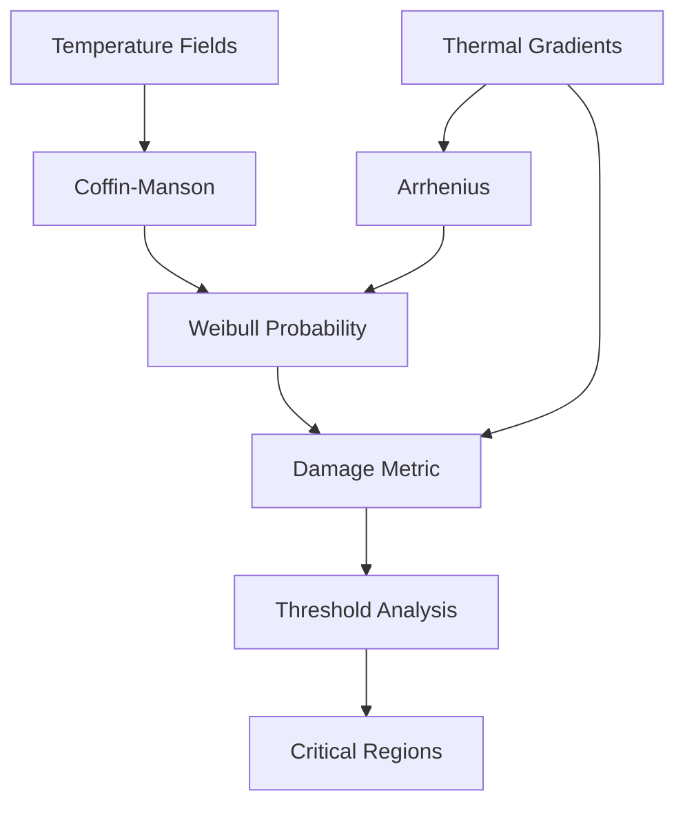

# **Thermo-Mechanical Fatigue Analysis for Electronics Reliability**  
This workflow combines **thermo-mechanical fatigue theory**, **material degradation models**, and **statistical reliability analysis**. Below is the breakdown:

---

## **1. Coffin-Manson Fatigue Model**  
**Physics**: Predicts low-cycle fatigue life due to plastic strain accumulation during thermal cycling.  

**Code Snippet**:  
```python
plastic_strain = mat_props['alpha'] * delta_temp
cycles_to_failure = (mat_props['C'] / plastic_strain)**(1/mat_props['m'])
```  

**Equation**:  

$$
N_f = \left( \frac{C}{\Delta \epsilon_p} \right)^{1/m}
$$

$\Delta \epsilon_p = \alpha \cdot \Delta T  \quad \text{(Thermal expansion-induced plastic strain)}$

$C, m:\quad \text{Material constants from fatigue testing}$


---

## **2. Arrhenius Thermal Degradation**  
**Physics**: Models temperature-dependent material aging (e.g., solder joint embrittlement).  

**Code Snippet**:  
```python
degradation = np.exp(-mat_props['Ea']/(8.617e-5 * T.mean()))
```  

**Equation**:  

$$
\text{Degradation Factor} = e^{-E_a / (k_B \cdot T)}
$$

$\( E_a \): \quad \text{Activation energy (eV)}$

$\( k_B \): \quad \text{Boltzmann constant} (\ 8.617 \times 10^{-5} \, \text{eV/K} \)$

$\( T \): \quad \text{Mean temperature (K)}$

---

## **3. Weibull Failure Probability**  
**Physics**: Statistical likelihood of failure based on fatigue cycles.  

**Code Snippet**:  
```python
failure_prob = 1 - np.exp(-(cycles_to_failure/eta)**beta)
```  

**Equation**:

$$
P_{\text{failure}} = 1 - \exp\left(-\left(\frac{N_f}{\eta(T)}\right)^\beta\right)
$$

$\eta(T) = \eta_0 \cdot \text{Degradation Factor} \quad \text{(Temperature-adjusted characteristic life)}$

$\( \beta \):  \quad \text{Weibull shape parameter (material homogeneity)}$

---

## **4. Combined Damage Metric**  
**Physics**: Integrates thermal gradients, material sensitivity, and failure probability.  

**Code Snippet**:  
```python
damage = (failure_prob * grad * mat_props['stress_sensitivity'])
```  

**Equation**:

$$
\text{Damage} = P_{\text{failure}} \cdot \|\nabla T\| \cdot S_{\text{sens}}
$$

$\|\nabla T\|: \quad \text{Thermal gradient magnitude (drives mechanical stress)}$

$S_{\text{sens}}: \quad \text{Material-specific stress sensitivity factor}$

---

## **Workflow Architecture**  


---

## **Code-Physics Integration**  

### **Material-Specific Processing**  
```python
material_params = {
    1: {  # Silicon
        'alpha': 2.6e-6,      # CTE (1/K)
        'C': 0.026,           # Fatigue ductility coefficient
        'm': 0.12,            # Fatigue exponent
        'Ea': 0.7,            # Activation energy (eV)
        'weibull_beta': 2.3,  # Weibull shape
        'stress_sensitivity': 0.85
    },
    2: {  # Solder
        'alpha': 21e-6,       # Higher CTE
        'C': 0.33,            # More ductile
        'Ea': 0.5,            # Lower activation energy
        'stress_sensitivity': 1.2
    }
}
```  
- Silicon has lower thermal expansion but higher activation energy than solder.  
- Solder’s higher  $\alpha$ and lower $E_a$ make it more prone to thermal fatigue.  

---

### **Time-Dependent Analysis**  
```python
time_scoping = ops.utility.time_freq_scoping_fc(time_ids=list(range(1,11)))
```  
- Evaluates damage accumulation over 10 thermal cycles.  
- Requires tracking $\Delta T$ and $T_{\text{mean}}$ across cycles.  

---

### **Threshold Detection**  
```python
threshold_op.inputs.threshold.connect(0.8)  # Critical damage level
```  
- Flags regions where $\text{Damage} \geq 0.8$ for reliability assessment.  

---

## **Motivation for a Custom Operator**  
1. **Nonlinear Model Coupling**:  
   - Damage depends on $P_{\text{failure}} \times \|\nabla T\| \times S_{\text{sens}}$ — no operator combines these multiplicatively.  

2. **Stateful Calculations**:  
   - Fatigue damage accumulates over cycles, requiring memory of prior states.  

3. **Material-Dependent Math**:  
   - Different equations for silicon vs solder need custom branching logic.  

4. **Advanced Statistics**:  
   - Weibull parameters require special distribution functions not in DPF.  

---

## **Summary**  
This workflow integrates:  
- **Thermal physics** (gradients, expansion)  
- **Material science** (fatigue, degradation)  
- **Reliability engineering** (Weibull statistics)  

By combining these through custom Python logic, it achieves what built-in operators cannot: **multi-physics, time-aware fatigue prediction** tailored to electronics packaging.  
